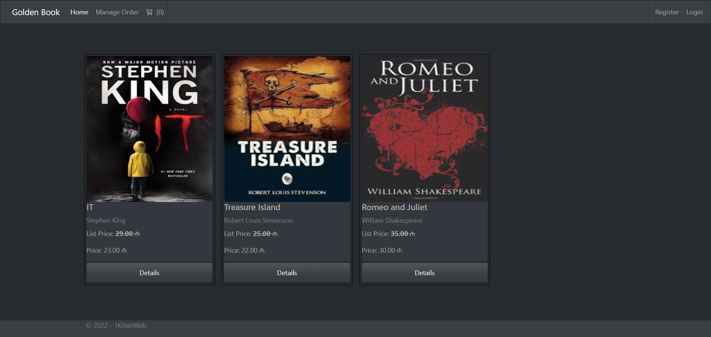
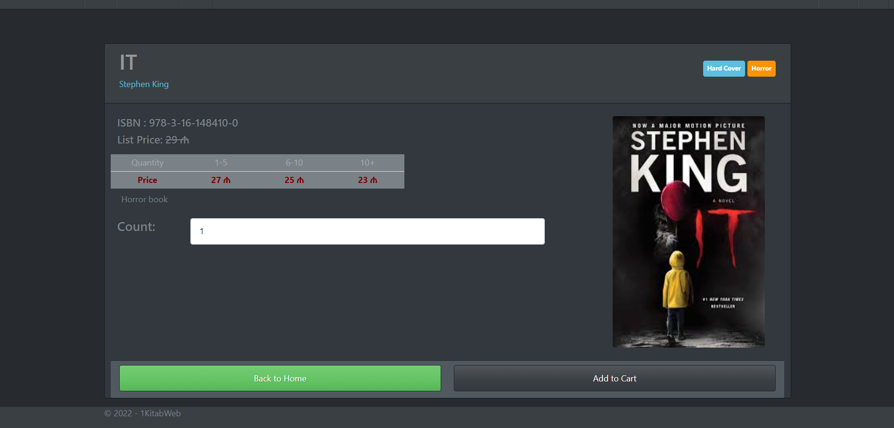
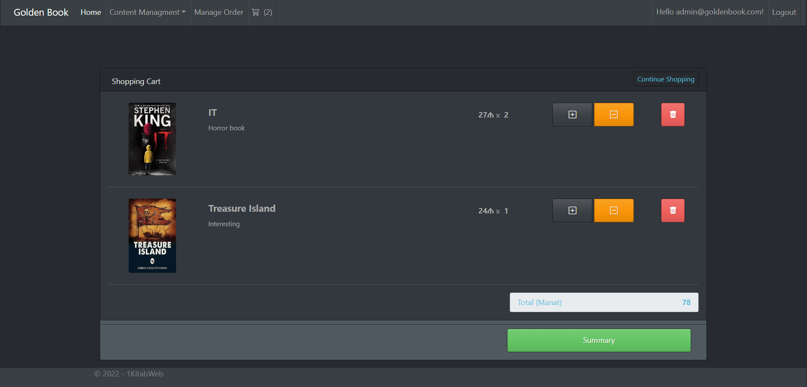
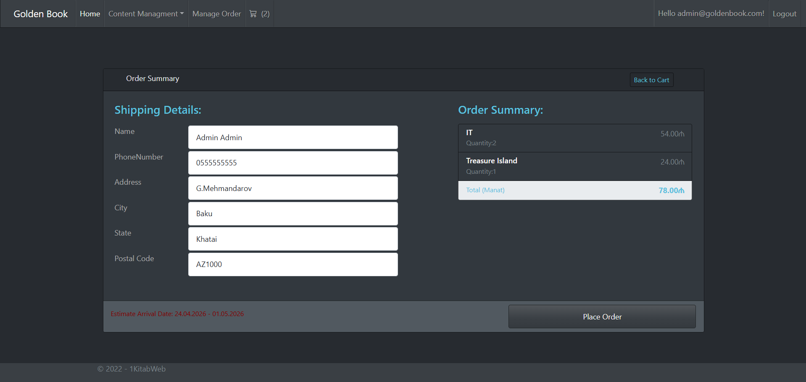
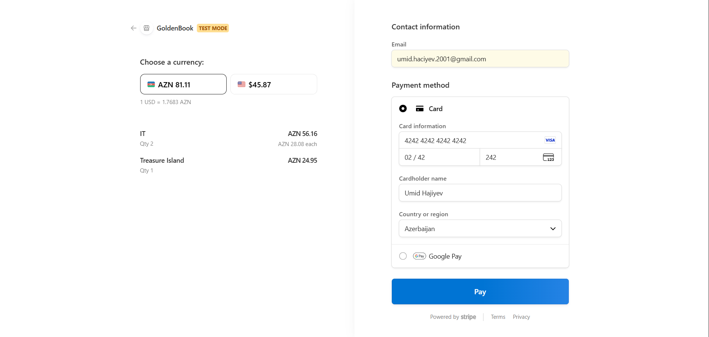
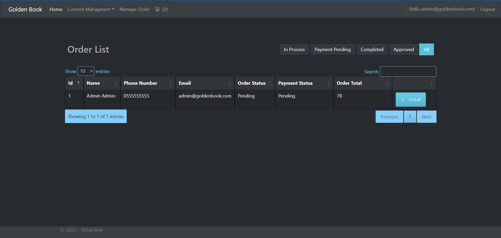

# GoldenBook E-Commerce

GoldenBook is an ASP.NET Core MVC e-commerce web application built with .NET 6, Entity Framework Core, SQL Server, and ASP.NET Core Identity.

It includes core online store features such as product management, category management, shopping cart functionality, authentication/authorization, and admin features.

## Features

- Product listing and details
- Category and cover type management
- Shopping cart
- User registration and login
- Role-based authorization
- Admin panel
- Order management
- Database integration with SQL Server
- Entity Framework Core migrations and seeding

## Tech Stack

- ASP.NET Core MVC
- C#
- .NET 6
- Entity Framework Core
- SQL Server
- ASP.NET Core Identity
- Bootstrap / CSS
- Stripe integration

## Project Structure

- `GoldenBookWeb` – main web application
- `GoldenBook.DataAccess` – database context, repositories, migrations
- `GoldenBook.Models` – domain models
- `GoldenBook.Utility` – utility constants and helpers

## Getting Started

### Prerequisites

Make sure you have these installed:

- Visual Studio 2022
- .NET 6 SDK
- SQL Server / SQL Server Express / LocalDB
- Git

### Installation

1. Clone the repository

```bash
git clone https://github.com/UmidHajiyev/GoldenBook_E-Commerce.git
cd GoldenBook_E-Commerce
```

2. Open the solution file in Visual Studio
Open GoldenBook.sln

3. Restore NuGet packages
dotnet restore

4. Update the connection string in GoldenBookWeb/appsettings.json
Example:
"ConnectionStrings": {
  "DefaultConnection": "Server=hope;Database=GoldenBookTest;Trusted_Connection=True;TrustServerCertificate=True"
}

5. Run the application
Set GoldenBookWeb as the startup project
Run the app from Visual Studio

## Admin Login

Default admin account:

Email: admin@goldenbook.com
Password: Admin123@

## Notes

The app uses SQL Server for data storage.
If the app does not start, make sure your SQL Server connection string is correct.
If styling does not load, check static files and CSS paths inside wwwroot.

## Learning Outcome

This project helped me practice:

ASP.NET Core MVC structure
Entity Framework Core
SQL Server configuration
Authentication and authorization
Project setup and debugging
Git and GitHub workflow

## Screenshots

After you login as an admin you need to add some Category, Cover type and Products. After homepage will look like this


You can click to Spesific book and see detail and add it to your cart


Now you can place order from your cart


This is summary page you need to fill before place order


You will be redirected to stripe where you can pay with this fake card:
 _______________________________
|   				            |
|  4242 4242 4242 4242		    |
|				                |
|  02/42	242		            |
| 				                |
|    Your Name		         	|
|			            VISA    |
 ‾‾‾‾‾‾‾‾‾‾‾‾‾‾‾‾‾‾‾‾‾‾‾‾‾‾‾‾‾‾‾


After you place order admin can see your order and can update your order status afterwards


## Future Improvements
Improve UI/UX
Add better product search and filtering
Add image upload improvements
Improve order tracking
Deploy the application online
## Author

### Umid Hajiyev
Computer Science graduate | Backend Developer

GitHub: [UmidHajiyev](https://github.com/UmidHajiyev)